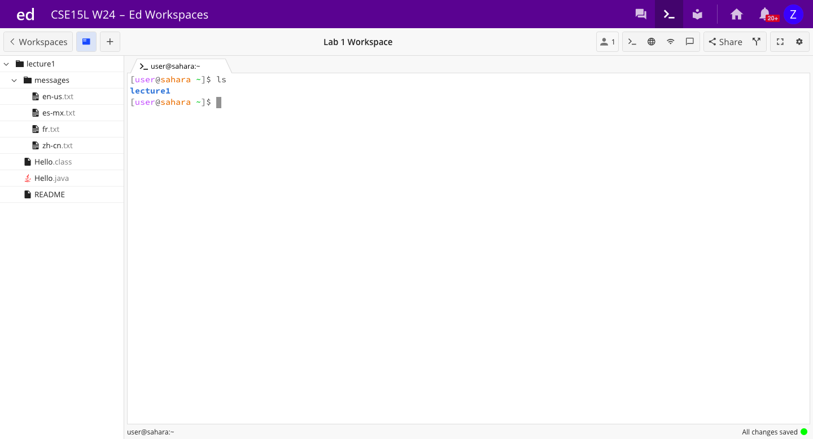
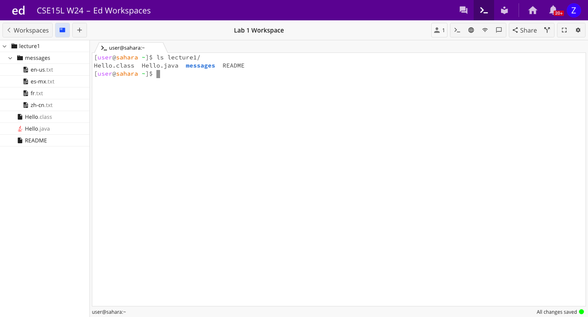
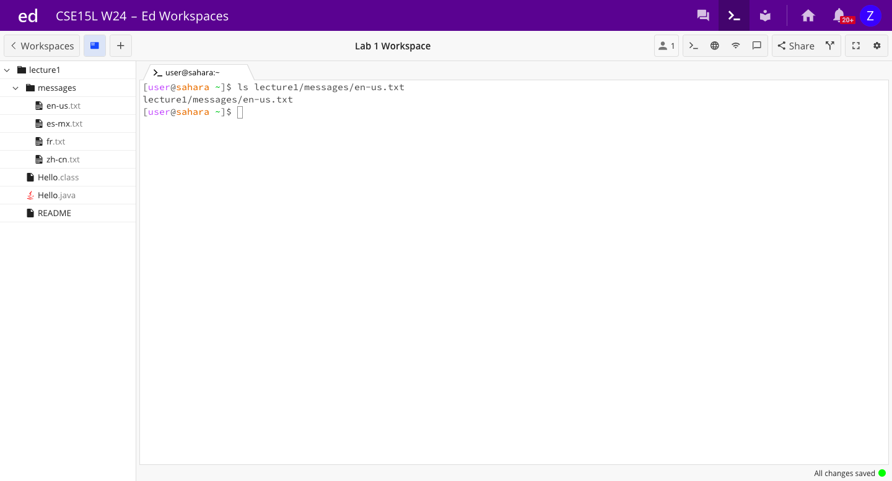
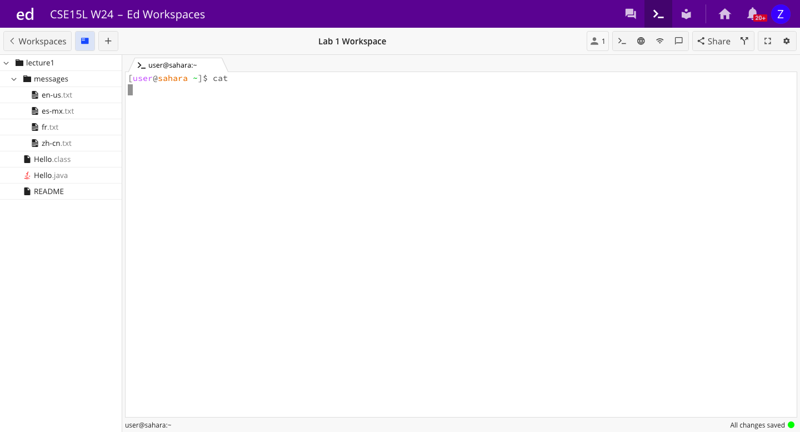
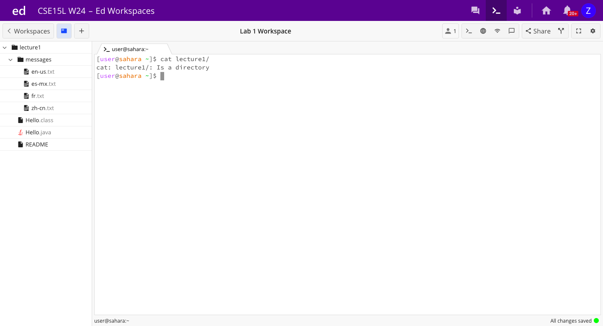
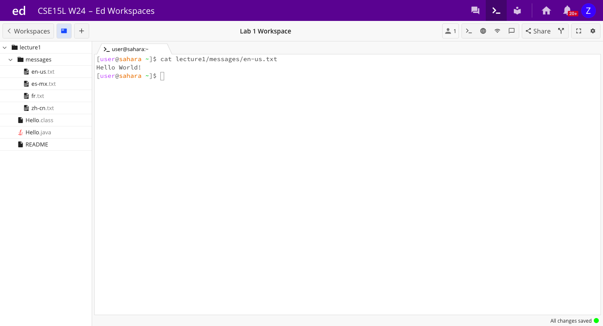

# Lab Report 1: Remote Access and FileSystem

---

**For `cd` command:**

**An example of using the command with no arguments:**

Before this command was run, the working directory was `/home`. This didn't change after the command was run.

Since we are already in the home directory and no arguments were given when we called `cd`, we remain in the home directory and nothing has changed. However, if we are not already in the home directory and we run `cd` without any arguments, then we change to the home directory. 

It doesn't produce an error.

**An example of using the command with a path to a directory as an argument:**

Before this command was run, the working directory was `/home`. After the command was run, the working directory was `/home/lecture1`.

Nothing was given as an output, however we can see that our command changed the directory because in the line underneath the command, we can see that the ~ is followed by `/lecture1`, indicating that the directory has been changed to `/home/lecture1`.

This command works as it should and does not produce an error.

**An example of using the command with a path to a file as an argument:**

Before the `cd en-us.txt/` command was run, the directory was `/home/lecture1/messages`. The command did not change the working directory.

The output after this command was `bash: cd: en-us.txt/: Not a directory`. We recieved this output becasue you can not change the directory to a file, you can only change the directory to a directory. This is why this command didn't change the directory.

This command produces an error, because the current working directory did not change to the file. 

---

**For `ls` command:**

**An example of using the command with no arguments:**

Before this command was run, the working directory was `/home`. After it was run, the working directory was the same (this command does not change the working directory).

The output after this command was `lecture1`. This was output because the `ls` command outputs what is included in the specified directory. In this case, there was no argument, so the `ls` command was called on the `/home` file. It output the file which was inside this file: `lecture1`.

This command works as it should and does not produce an error.

**An example of using the command with a path to a directory as an argument:**

Before this command was run, the working directory was `/home`. After it was run, the working directory was the same (this command does not change the working directory).

The output after this command was `Hello.class  Hello.java  messages  README`. This was output because the `ls` command was called on the `lecture1/`. So, it output all of the files, folders and pages inside of it, which are `Hello.class`, `Hello.java`, `messages`, and `README`.

This command works as it should and does not produce an error.

**An example of using the command with a path to a file as an argument:**

Before this command was run, the working directory was `/home`. After it was run, the working directory was the same (this command does not change the working directory).

The output after this command was `lecture1/messages/en-us.txt`. This is because the `ls` command was called on a specific file itself, rather than a folder that has contents. So, the command prints the file itself that was given as input. 

This command works as it should and does not produce an error.

---

**For `cat` command:**

**An example of using the command with no arguments:**

Before this command was run, the working directory was `/home`. After it was run, the working directory was the same (this command does not change the working directory).

This command had no output. Because `cat` cannot be run without an argument, it is waiting for the user to enter an argument. 

No error has occured, it is simply waiting for the user to enter an argument so `cat` can do its job. This means that if the user entered an argument after this, it would act as it should.

**An example of using the command with a path to a directory as an argument:**

Before this command was run, the working directory was `/home`. After it was run, the working directory was the same (this command does not change the working directory).

The output of this command was: `cat: lecture1/: Is a directory`. This means that the `cat` command cannot be run with a directory as an argument, it needs a file. So, when it is run with a directory as the argument, it doesn't output what it should (the contents of the argument), but instead tells the user why it didn't work as it should (because a directory was given as an argument). 

This command doesn't work as it should, meaning it produces an error. 

**An example of using the command with a path to a file as an argument:**

Before this command was run, the working directory was `/home`. After it was run, the working directory was the same (this command does not change the working directory).

The outout of this command was: `Hello World!`. This was the output because the `cat` command outputs what is inside the file given as an arument. In this case, the `en-us.txt` text file contains the words `Hello World!`. 

This command works as it should and does not produce an error. 
