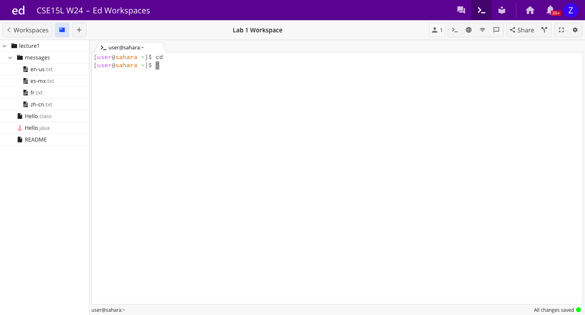
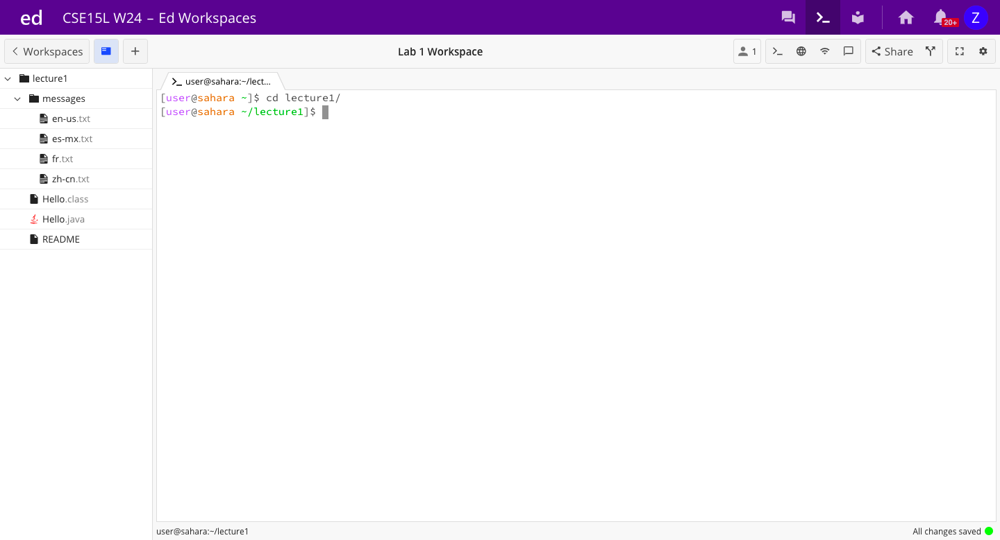
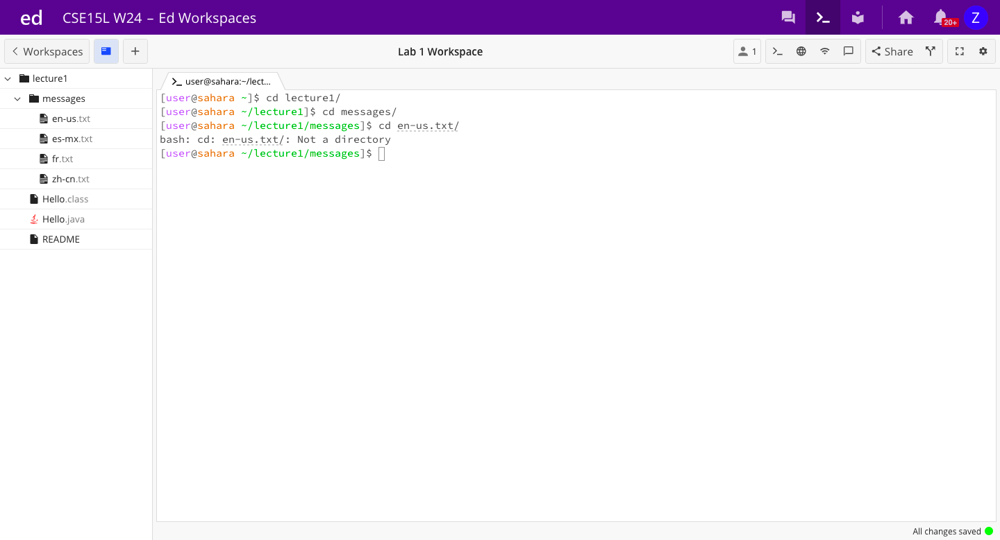

# Lab Report 1: Remote Access and FileSystem

**For `cd` command:**

1. An example of using the command with no arguments.

Before this command was run, the working directory was `/home`. This didn't change after the command was run.

Because no arguments were given and we called `cd`, we did not change the directory. Having no arguments meant that we didn't give the name of a file to change the directory to, so nothing was output and the directory didn't change (this is visible on the line below where the `cd` command was called, where we can see that nothing after the ~ has changed. 

2. An example of using the command with a path to a directory as an argument.

Before this command was run, the working directory was `/home`. After the command was run, the working directory was `/home/lecture1`.

Nothing was given as an output, however we can see that our command changed the directory because in the line underneath the command, we can see that the ~ is followed by `/lecture1`, indicating that the directory has been changed to `/home/lecture1`.

3. An example of using the command with a path to a file as an argument.

Before the `cd en-us.txt/` command was run, the directory was `/home/lecture1/messages`. The command did not change the working directory.

The output after this command was `bash: cd: en-us.txt/: Not a directory`. We recieved this output becasue you can not change the directory to a file, you can only change the directory to a directory. This is why this command didn't change the directory.

**For `ls` command:**

1. An example of using the command with no arguments.

2. An example of using the command with a path to a directory as an argument.

3. An example of using the command with a path to a file as an argument.

**For `cat` command:**

1. An example of using the command with no arguments.

2. An example of using the command with a path to a directory as an argument.

3. An example of using the command with a path to a file as an argument.

