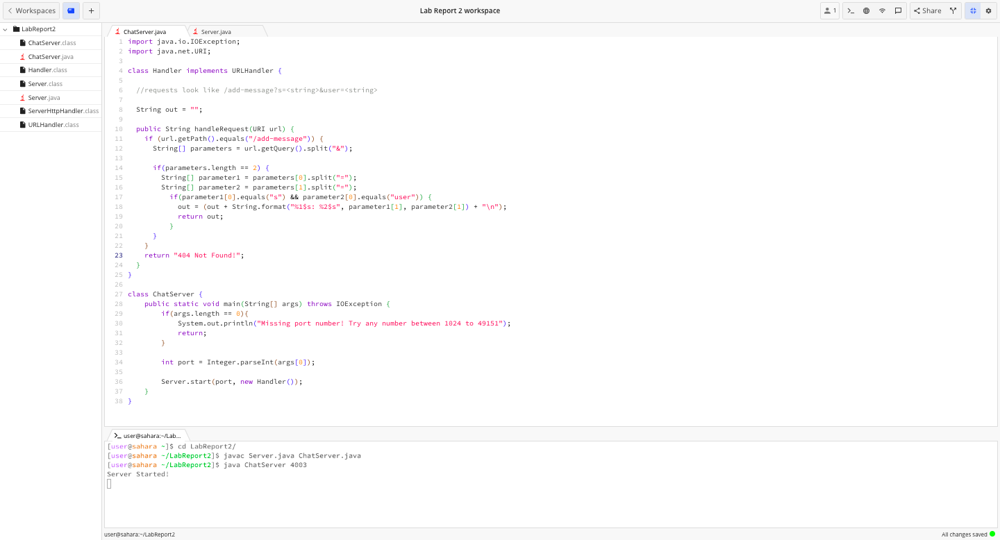

# Lab Report 2 - Servers and SSH Keys

### Part 1:

**Code for `ChatServer`:**

**Screenshots of using /message in the URL**

**Which methods in the code are called?**
The methods `public String handleRequest(URI url)` and `public static void main(String[] args) throws IOException` are both called.

**What are the relevant arguments to those methods, and the values of any relevant fields of the class?**
The `main` method is called with 4003 as an argument when I first called the `ChatServer` file. This is what opened the port and allowed the website to open. 
The `handleRequest` method is called with the url as the argument: `https://0-0-0-0-4003-j3t0pfnj4ngjvis7lh417gj06c.us.edusercontent.com/add-message?s=Hello!&user=Zoe`. The relevant fields in the class are `String [] parameters`, `String[] parameter1`, and `String[] parameter2`, which were not initialized before the method call, and `String out`, which is set to `""` before the method call.

**How do the values of any relevant fields of the class change from this specific request? If no values got changed, explain why.**
My code in the `handleRequest` method creates a field called `String[] parameters`, which, after the request, is set to be the two parameters given in the url Path by splitting the path at `&`. In this case, the contents of `parameters` are `s=Hello!` and `user=Zoe`. 
The `String[] parameter1` field is set to `{s, Hello!}` by splitting the first element in the `parameters` array.
The `String[] parameter2` field is set to `{user, Zoe}` by splitting the second element in the `parameters` array.
(Before any of these fields are set, the url Path is checked to ensure that it has the right contents to successfully create these arrays).

**Which methods in the code are called?**

**What are the relevant arguments to those methods, and the values of any relevant fields of the class?**

**How do the values of any relevant fields of the class change from this specific request? If no values got changed, explain why.**

### Part 2:
