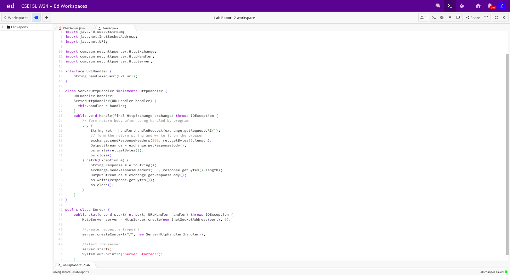
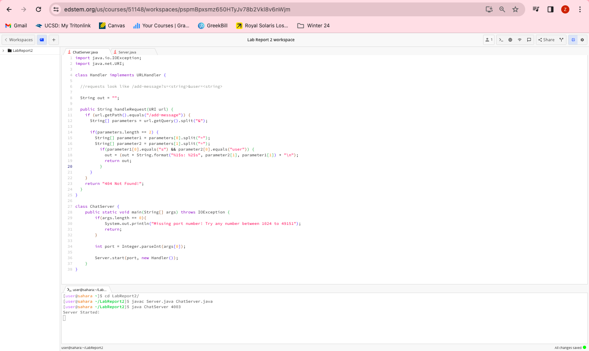
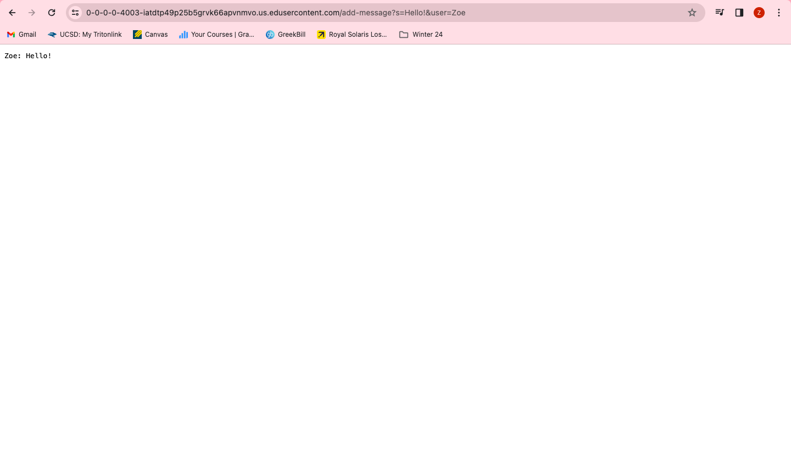
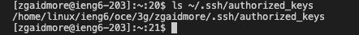
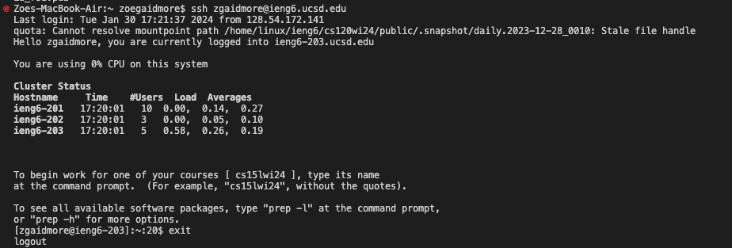

# Lab Report 2 - Servers and SSH Keys

### Part 1:

**Code for `ChatServer`:**

**Screenshots of using /message in the URL**

**Which methods in the code are called?**
The methods `public String handleRequest(URI url)` and `public static void main(String[] args) throws IOException` are both called.

**What are the relevant arguments to those methods, and the values of any relevant fields of the class?**
The `main` method is called with 4003 as an argument when I first called the `ChatServer` file. This is what opened the port and allowed the website to open. 
The `handleRequest` method is called with the url as the argument: `https://0-0-0-0-4003-j3t0pfnj4ngjvis7lh417gj06c.us.edusercontent.com/add-message?s=Hello!&user=Zoe`. The relevant fields in the class are `String [] parameters`, `String[] parameter1`, and `String[] parameter2`, which were not initialized before the method call, and `String out`, which is set to `""` before the method call.

**How do the values of any relevant fields of the class change from this specific request? If no values got changed, explain why.**
My code in the `handleRequest` method creates a field called `String[] parameters`, which, after the request, is set to be the two parameters given in the url Path by splitting the path at `&`. In this case, the contents of `parameters` are `s=Hello!` and `user=Zoe`. 
The `String[] parameter1` field is set to `{s, Hello!}` by splitting the first element in the `parameters` array.
The `String[] parameter2` field is set to `{user, Zoe}` by splitting the second element in the `parameters` array.
The `out` parameter, at the end of this method, is set to `Zoe: Hello!` and then is returned.
(Before any of these fields are set, the url Path is checked to ensure that it has the right contents to successfully create these arrays).

**Which methods in the code are called?**
The methods `public String handleRequest(URI url)` and `public static void main(String[] args) throws IOException` are both called.

**What are the relevant arguments to those methods, and the values of any relevant fields of the class?**
The `main` method is called with 4003 as an argument when I first called the `ChatServer` file. This is what opened the port and allowed the website to open. 
The `handleRequest` method is called with the url as the argument: `https://0-0-0-0-4003-iatdtp49p25b5grvk66apvnmvo.us.edusercontent.com/add-message?s=Hi!&user=Nora`. The relevant fields in the class are `String [] parameters`, `String[] parameter1`, and `String[] parameter2`, which were not initialized before the method call, and `String out`, which is set to `""` before the method call.

**How do the values of any relevant fields of the class change from this specific request? If no values got changed, explain why.**
My code in the `handleRequest` method creates a field called `String[] parameters`, which, after the request, is set to be the two parameters given in the url Path by splitting the path at `&`. In this case, the contents of `parameters` are `s=Hi!` and `user=Nora`. 
The `String[] parameter1` field is set to `{s, Hi!}` by splitting the first element in the `parameters` array.
The `String[] parameter2` field is set to `{user, Nora}` by splitting the second element in the `parameters` array.
The `out` parameter, at the end of this method, is set to `Zoe: Hello!\nNora: Hi!` and then is returned.
(Before any of these fields are set, the url Path is checked to ensure that it has the right contents to successfully create these arrays).

### Part 2:
The absolute path to the private key for your SSH key for logging into ieng6 (on your computer, an EdStem workspace, or on the home directory of the lab computer)

The absolute path to the public key for your SSH key for logging into ieng6 (this is the one you copied to your account on ieng6, so it should be a path on ieng6's file system)

A terminal interaction where you log into your ieng6 account without being asked for a password.

### Part 3:
I learned a lot of new things in our lab in Weeks 2 and 3, but one thing that stands out, even if it seems like a smaller thing in comparison to *everything* we've learned in the past two weeks, is how using the `man` command in the terminal can allow us to read about  any terminal command. This stands out to me because it is something that is so useful, and I can use to better understand many new terminal commands that we will learn, or even ones we won't cover in class, and it shows us the user manual for these commands. 
