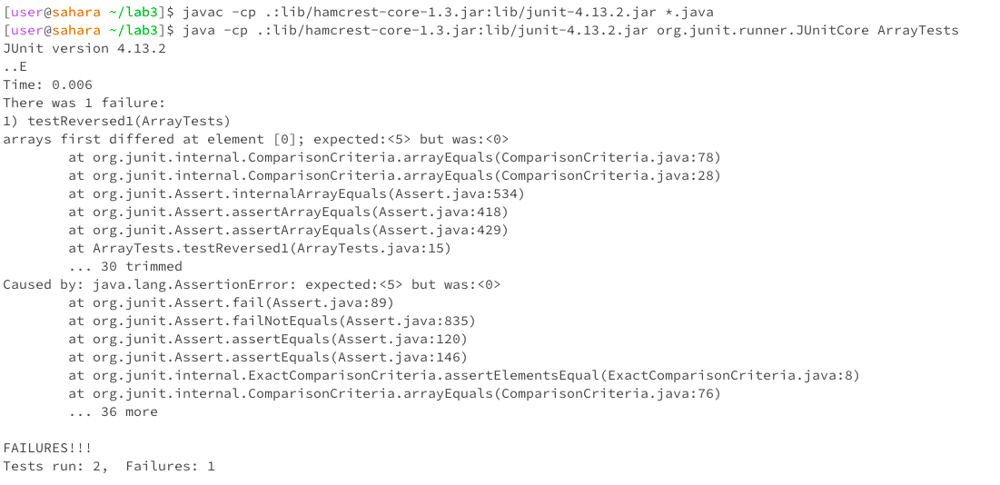

# Lab Report 3 - Bugs and Commands

### Part 1:

Completed in reference to the bug in the `static int[] reversed(int[] arr)` method.

**A failure-inducing input for the buggy program, as a JUnit test and any associated code:**
```
@Test
public void testReversed1() {
	int[] input1 = new int[]{1, 2, 3, 4, 5};
	assertArrayEquals(new int[]{5, 4, 3, 2, 1}, ArrayExamples.reversed(input1));
}
```

**An input that doesn't induce a failure, as a JUnit test and any associated code:**
```
@Test
public void testReversed1() {
	int[] input1 = new int[]{1, 2, 3, 4, 5};
	assertArrayEquals(new int[]{5, 4, 3, 2, 1}, ArrayExamples.reversed(input1));
}
```
This is the JUnit test code that was given in the original file, and it does not induce a failure. The array `{3}` is correctly reversed according to this test.

**The symptom, as the output of running the tests:**



**The bug, as the before-and-after code change required to fix it:**

Before fixing the bug:
```
static int[] reversed(int[] arr) {
	int[] newArray = new int[arr.length];
	for(int i = 0; i < arr.length; i += 1) {
		arr[i] = newArray[arr.length - i - 1];
	}
	return arr;
}
```

After fixing the bug:
```
static int[] reversed(int[] arr) {
	int[] newArray = new int[arr.length]; //new arr = [0, 0, 0, 0, 0]
	for(int i = 0; i < arr.length; i += 1) {
		newArray[i] = arr[arr.length - i - 1];
    	}
	return newArray;
}
```

This change in code fixed the bug because the original code created a new empty array called `newArray`, then, in reverse order, added the elements of `newArray` to the original array `arr`. So, the elemtns of the empty array (all 0's) were added to the array `arr`, which was then returned. So, the returned array would be all 0's.
The new code, however, added the elements of `arr` to the empty array `newArray` in reverse order. `newArray` is then returned, which is an array containing the elemtns of `arr` in reverse order. 

### Part 2:
