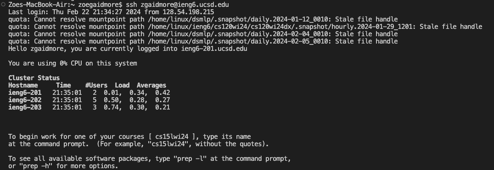
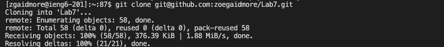
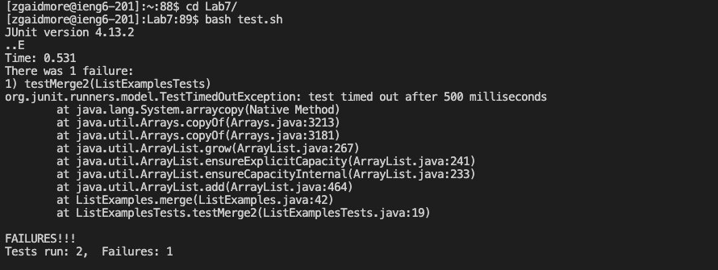
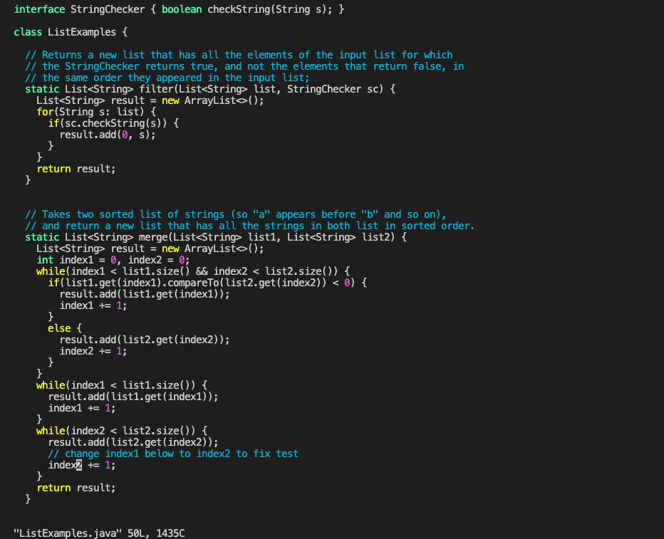
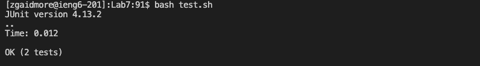
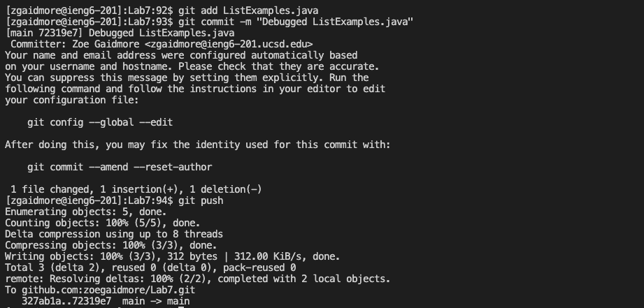

# Lab Report 4 - Vim

## **Step 4:** Log into ieng6

Keys pressed:

`<up><enter>`

The command to log into my ieng6 account (`ssh zgaidmore@ieng6.ucsd.edu`) was one up in my terminal history, which is why I used the up arrow once, to access the command, then entered. This successfully logged me into my ieng6 account.

**Step 5:** Clone your fork of the repository from your Github account (using the `SSH` URL)

Keys pressed:

`git clone <command v><enter>`

I typed `git clone` because it is the command to clone a repository. Then, I typed `<command v>` to paste the `SSH` URL, which I had copied from the github repository. I then pressed `<enter>`, which ran the command and successfully cloned the repository.

**Step 6:** Run the tests, demonstrating that they fail

Keys pressed:

`cd L<tab> <enter>`
`bash test.sh <enter>`

I typed the command `cd` to change the directory into the repository that I had just cloned (`Lab7`). I then typed `L` and then the `<tab>` key, which completed the name of the directory I wanted to `cd` into (`Lab7`).

NOTE: I changed the name of my forked repository in github from `lab7` to `Lab7`, because during lab I had git cloned the `lab7` repository, so to demonstrate these steps a second time I had to rename it, as a `lab7` directory was previously made.

I then typed the `<enter>` key, successfully running changing the directory.

Then, I typed `bash test.sh`, before using the `<enter>` key to successfully run the tests, which were in the `test.sh` file. 

**Step 7:** Edit the code file to fix the failing test

Keys pressed:

`vim L<tab>.java <enter>

These commands allowed me to enter vim. I used the `vim` command, then typed `L` and used the `<tab>` key to autocomplete to `ListExamples`, the file in `Lab7` that I wanted to access using vim. I added the `.java`, then used the `<enter>` key to run this command and access the file in vim mode.

Keys pressed once in vim:

`jlxi2<esc>:wq`

The `j` key scrolls down. I *held down* on this key until I got to the line I wanted in the file, line 43, which had the error. The 'l' key scrolls to the left. I again *held down* on this key, rather than simply tapping it, until I got to the position of the error (the curser was over the "1" in `index1` which would be changed to a "2"). Then, I used the `x` vim command to delete the "1" that my curser was over. Then, I used the `i` command to enter insert mode, before typing "2", which inserted a "2" where the "1" previously was. I used the `<esc>` key to exit insert mode and enter normal mode again. Then, I typed `:wq`, which allowed me to save my changes and then exit vim.

**Step 8:** Run the tests, demonstrating that they now succeed

Keys pressed:

`<up><up><enter>`

The `bash test.sh` command was two up in my terminal command history, so I used the `<up>` key twice to access it, before using the `<enter>` key to run the command, therefore running the tests. 

**Step 9:** Commit and push the resulting change to your Github account

Keys pressed:

`git add L<tab><enter>`
`git commit -m "Debugged ListExamples.java"<enter>`
`git push<enter>`

The first terminal command I typed was `git add`, then I typed `L` and the `<tab>` key, to complete `ListExamples.java`, because that was the file that was edited. Then, I used the `<enter>` key to run this command and add my changes.

Next, I typed `git commit -m "Debugged ListExamples.java`. This command commits my changes, and I added the message "Debugged ListExamples.java" to explain what changes were made. The `<enter>` key ran this command.

Next, I used the `git push` command and the `<enter>` key to run it, thereby pushing the changes I made to the respository on Github.
