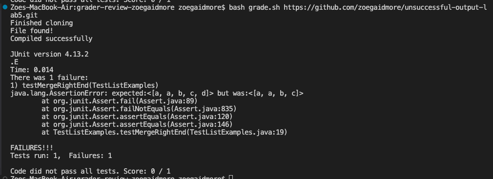

# Lab Report 5 - Putting it All Together

### Part 1 – Debugging Scenario 

**The original post from a student with a screenshot showing a symptom and a description of a guess at the bug/some sense of what the failure-inducing input is. (Don't actually make the post! Just write the content that would go in such a post)**

Hi there, my ListExamples.java code isn't passing my tests, and I'm not sure what's wrong.

I've attatched an image of the symptom of the bug. The test file tests the merge method with the arrays `["a", "b", "c"]` and `["a", "d"]`. Initially I thought that it was a problem in my iterating over the arrays, because it appears that the last element of the second array wasn't added to the merged array. However, I don't see any issues with my while loop.


**A response from a TA asking a leading question or suggesting a command to try (To be clear, you are mimicking a TA here.)**

Hello, you should try to write a few extra tests, to see if it is an issue with the iterator or something else. Maybe write a test where  the element that will be the last in the resulting array (the "greatest" element) is in the shorter of the two arrays.


**Another screenshot/terminal output showing what information the student got from trying that, and a clear description of what the bug is.**

I added the recommended test, and my new output was:

So, it appears that the problem is not with my code that iterates through the second array, but rather the problem lies with adding elements to the array after all of the elements from *one* array are added, leaving only elements from the other. 


**The file & directory structure needed**


**The contents of each file before fixing the bug**

The contents of the buggy `ListExamples.java` file:
```
import java.util.ArrayList;
import java.util.List;

interface StringChecker { boolean checkString(String s); }

class ListExamples {

  static List<String> result = new ArrayList<>();
  // Returns a new list that has all the elements of the input list for which
  // the StringChecker returns true, and not the elements that return false, in
  // the same order they appeared in the input list;
  static List<String> filter(List<String> list, StringChecker sc) {
    if(list.size() == 0) { 
        return list; 
    }
    result.clear();
    for(String s: list) {
      if(sc.checkString(s)) {
        result.add(s);
      }
    }
    return result;
  }


  // Takes two sorted list of strings (so "a" appears before "b" and so on),
  // and return a new list that has all the strings in both list in sorted order.
  static List<String> merge(List<String> list1, List<String> list2) {
    List<String> result = new ArrayList<>();
    int index1 = 0, index2 = 0;
    while(index1 < list1.size() && index2 < list2.size()) {
      if(list1.get(index1).compareTo(list2.get(index2)) < 0) {
        result.add(list1.get(index1));
        index1 += 1;
      }
      else {
        result.add(list2.get(index2));
        index2 += 1;
      }
    }
    return result;
  }
}
```

The contents of the `grade.sh` file:

```
CPATH='.:lib/hamcrest-core-1.3.jar:lib/junit-4.13.2.jar'

rm -rf student-submission
rm -rf grading-area

mkdir grading-area

git clone $1 student-submission 2> ta-output.txt
echo 'Finished cloning'

# check that the student submitted the right file 
if [[ -f "student-submission/ListExamples.java" ]]
then
    echo "File found!"
else
    echo "ListExamples.java not found! Score: 0"
    exit 1  # nonzero exit code to show there was an error
fi

# jar
cp -r lib grading-area
# ListExamples
cp student-submission/ListExamples.java grading-area/
# TestListExamples
cp TestListExamples.java grading-area/

# compile 

cd grading-area
javac -cp $CPATH *.java

# check for a compile error 
if [[ $? -ne 0 ]]
then
  echo "Compile error! Score: 0"
  exit 1
else 
    echo "Compiled successfully"
fi

java -cp $CPATH org.junit.runner.JUnitCore TestListExamples > junit-output.txt

# echo "Your score is $successes / $tests"
echo $lastline

if [[ $(grep -c "OK" "junit-output.txt") -ne 0 ]]
then
echo "Code passed all tests! Score: 1/1"
else
cat junit-output.txt
lastline=$(cat junit-output.txt | tail -n 2 | head -n 1)
tests=$(echo $lastline | awk -F'[, ]' '{print $3}')
failures=$(echo $lastline | awk -F'[, ]' '{print $6}')
successes=$((tests - failures)) 
echo "Code did not pass all tests. Score: $successes / $tests"
fi
```

**The full command line (or lines) you ran to trigger the bug**
**A description of what to edit to fix the bug**
